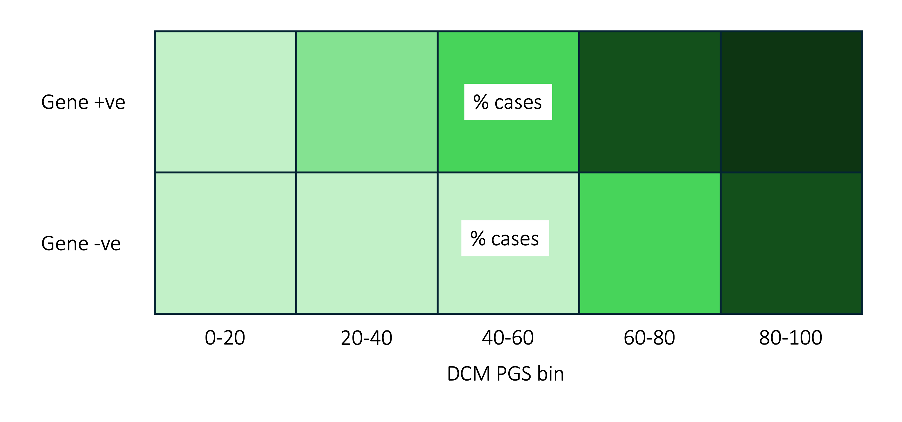
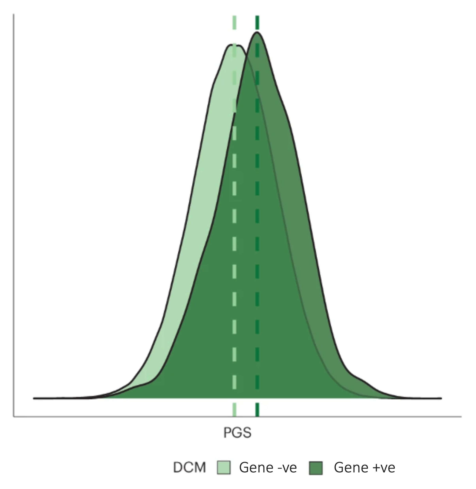
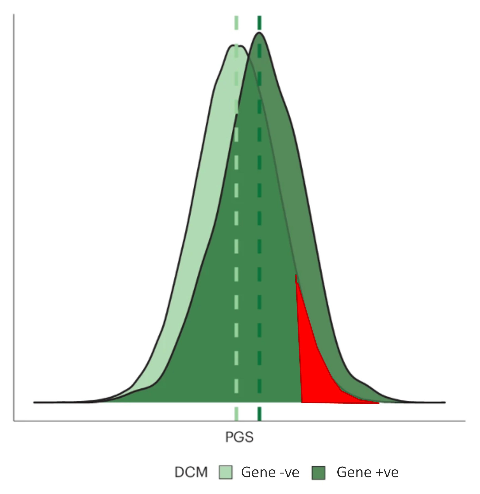
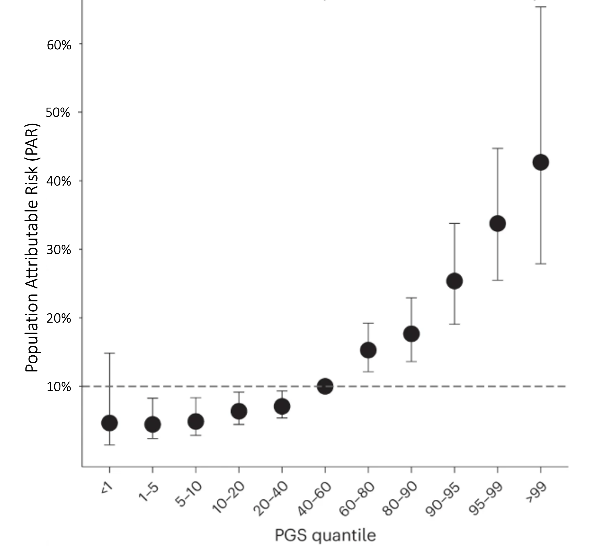

## Background

We will first focus on the DCM PGS, then extend this to BMI-adjusted and
BMI-PGS conditional genetic risk in due course.

The idea I have is to estimate the proportion of patients with gene
elusive DCM who have disease explained by their DCM PGS. A simple
approach would be partition the PGS (above certain level versus
remainder) and then declare presence or absence of risk. Ultimately we
want to provide an estimator of population attributable risk per
individual, using likelihood ratios.

------------------------------------------------------------------------

## Datasets

-   Primary dataset – GoDCM Imperial cohort of 1500 patients
-   +/- another DCM case cohort
-   UK Biobank for additional population analyses

------------------------------------------------------------------------

## Maths

#### Prevalence and Odds

The prevalence of dilated cardiomyopathy (DCM) is given as:

$$
P(D) = \frac{1}{250} = 0.004
$$

The odds of DCM (baseline or pre-test odds) can be calculated as:

$$
\text{Baseline odds} = \frac{P(D)}{1 - P(D)} = \frac{0.004}{1 - 0.004} = \frac{0.004}{0.996} \approx 0.004016
$$

#### Odds Ratio and Post-Test Probability

The odds ratio (OR) per standard deviation (SD) of the polygenic score
(PGS) is:

OR = 1.76  (95% CI: 1.64 − 1.9)

Using the likelihood ratio (LR) for the 99th percentile of the
unaffected population (calculated from ST-4
calculator)[1](#ref-adPerformancePolygenicRisk2023):

LR+ = 3.18

The post-test odds for DCM are calculated as:

Post-test odds = Baseline odds × LR+

Post-test odds = 0.004016 × 3.18 ≈ 0.01278

Convert the post-test odds to post-test probability:

$$
\text{Post-test probability} = \frac{\text{Post-test odds}}{1 + \text{Post-test odds}}
$$

$$
\text{Post-test probability} = \frac{0.01278}{1 + 0.01278} \approx 0.01262
$$

#### Attributable Fraction Among the Exposed (AFE)

The attributable fraction among the exposed (AFE) is calculated as:

$$
\text{AFE} = 1 - \frac{\text{Risk in unexposed}}{\text{Risk in exposed}}
$$

Where: - Risk in unexposed = baseline probability *P*(*D*) = 0.004 -
Risk in exposed = post-test probability *P*(*D* ∣ exposed) = 0.01262

$$
\text{AFE} = 1 - \frac{0.004}{0.01262}
$$

AFE = 1 − 0.3169 ≈ 0.6831

Thus, the attributable fraction among the exposed is approximately:

AFE ≈ 68.3%

------------------------------------------------------------------------

## Paper structure

1.  GREML h2SNP DCM UKB, versus heritability due to rare variation (need
    to find method)

2.  Review RR thresholds on risk and use as a framework to determine
    thresholds
    <https://clinicalgenome.org/working-groups/low-penetrance-risk-allele-working-group/>

3.  Estimate the proportion of cases with polygenic cause (then test in
    subsequent) see below working  
    

4.  GoDCM

    -   Gene positive – P/ LP in DCM gene  
    -   Gene negative – other

5.  Distribution of PGS in gene+ versus gene –ve  
    

6.  Identify gene neg with high polygenic score  
    

7.  Apply ‘diagnostic’ thresholds according to above

8.  Framework for calculating individual PAR

9.  Using attached framework, plot PAR against PGS centiles  
    

10. Conclude

    -   ~1/20 patients with DCM polygenic cause
    -   Role of diagnosis in testing

------------------------------------------------------------------------

## Useful papers

-   Monogenic and Polygenic Contributions to Atrial Fibrillation Risk:
    Results from a National
    Biobank[2](#ref-choiMonogenicPolygenicContributions2020)  
-   Assessing the contribution of rare variants to complex trait
    heritability from whole-genome sequence
    data[3](#ref-wainschteinAssessingContributionRare2022)  
-   Role of titin in cardiomyopathy: from DNA variants to patient
    stratification[4](#ref-wareRoleTitinCardiomyopathy2018a)  
-   Effect of potentially modifiable risk factors associated with
    myocardial infarction in 52 countries (the INTERHEART study):
    case-control
    study[5](#ref-yusufEffectPotentiallyModifiable2004)

------------------------------------------------------------------------

## References

1.
Ad H, J G, C F, Af S, R P, R S, V
K, C L, H H, Jk M, Nj W. Performance of polygenic risk scores in
screening, prediction, and risk stratification: Secondary analysis of
data in the Polygenic Score Catalog. *BMJ medicine*. 2023;2(1).
doi:[10.1136/bmjmed-2023-000554](https://doi.org/10.1136/bmjmed-2023-000554)

2.
Choi SH, Jurgens SJ, Weng LC,
Pirruccello JP, Roselli C, Chaffin M, Lee C, Hall AW, Khera AV, Lunetta
KL, Lubitz SA, Ellinor PT. Monogenic and Polygenic Contributions to
Atrial Fibrillation Risk: Results from a National Biobank. *Circulation
research*. 2020;126(2):200-209.
doi:[10.1161/CIRCRESAHA.119.315686](https://doi.org/10.1161/CIRCRESAHA.119.315686)

3.
Wainschtein P, Jain D, Zheng Z,
Cupples LA, Shadyab AH, McKnight B, Shoemaker BM, Mitchell BD, Psaty BM,
Kooperberg C, Liu CT, Albert CM, Roden D, Chasman DI, Darbar D,
Lloyd-Jones DM, Arnett DK, Regan EA, Boerwinkle E, Rotter JI, O’Connell
JR, Yanek LR, de Andrade M, Allison MA, McDonald MLN, Chung MK, Fornage
M, Chami N, Smith NL, Ellinor PT, Vasan RS, Mathias RA, Loos RJF, Rich
SS, Lubitz SA, Heckbert SR, Redline S, Guo X, Chen Y-DI, Laurie CA,
Hernandez RD, McGarvey ST, Goddard ME, Laurie CC, North KE, Lange LA,
Weir BS, Yengo L, Yang J, Visscher PM. Assessing the contribution of
rare variants to complex trait heritability from whole-genome sequence
data. *Nature Genetics*. 2022;54(3):263-273.
doi:[10.1038/s41588-021-00997-7](https://doi.org/10.1038/s41588-021-00997-7)

4.
Ware JS, Cook SA. Role of titin in
cardiomyopathy: From DNA variants to patient stratification. *Nature
Reviews Cardiology*. 2018;15(4):241-252.
doi:[10.1038/nrcardio.2017.190](https://doi.org/10.1038/nrcardio.2017.190)

5.
Yusuf S, Hawken S, Ôunpuu S, Dans
T, Avezum A, Lanas F, McQueen M, Budaj A, Pais P, Varigos J, Lisheng L.
Effect of potentially modifiable risk factors associated with myocardial
infarction in 52 countries (the INTERHEART study): Case-control study.
*The Lancet*. 2004;364(9438):937-952.
doi:[10.1016/S0140-6736(04)17018-9](https://doi.org/10.1016/S0140-6736(04)17018-9)
